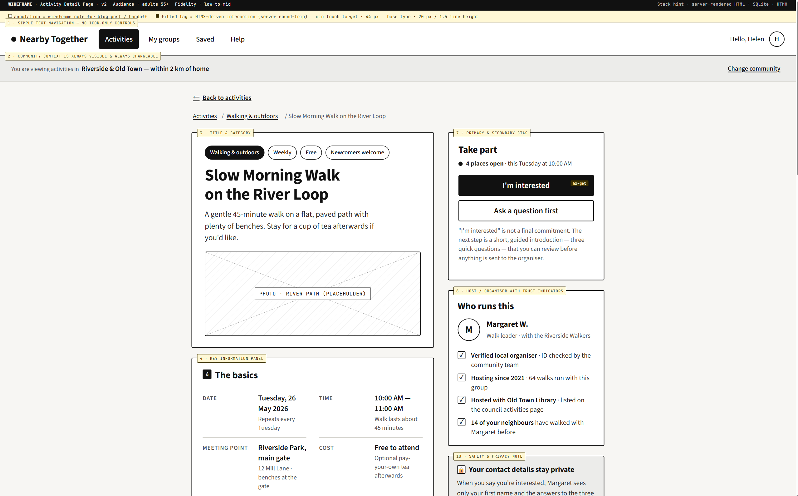
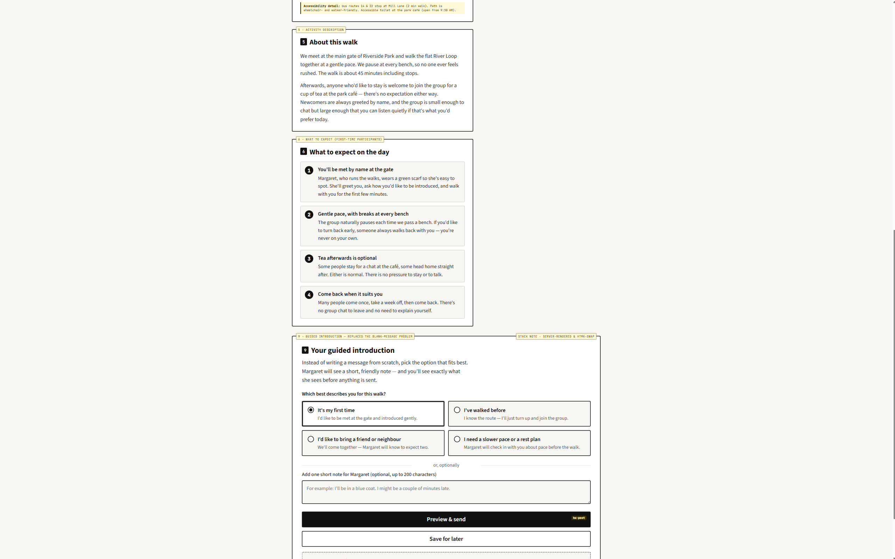

In the previous post, I narrowed the project from a general neighbourhood platform into an activity-first community connection service for adults aged 55 and above. This week, I wanted to test whether that idea could work at the screen level. Instead of designing the whole application at once, I focused on one critical screen: the Activity Detail page. This is where a user moves from browsing local opportunities to deciding whether they feel safe and confident enough to take part.

*Figure 1. Activity Detail wireframe v2. This screen tests how neighbourhood context, activity information, trust signals, and participation actions can work together.*

I chose this page because it carries several core functional requirements at the same time. The user needs to understand what the activity is, where it happens, whether it suits their mobility and comfort level, who is organising it, and what will happen if they express interest. If any of these are unclear, the platform may technically “work”, but it would not support the actual user need: low-pressure, trusted local social participation.

A key design decision was to keep the community context visible at the top of the page: “Riverside & Old Town — within 2 km of home”. This reinforces that the application is not a generic events platform. It is tied to a local area, which supports relevance and trust. I also included a clear “Change community” option because users should not feel trapped by an automatic location decision. This matters for accessibility and privacy: some users may prefer to manually choose a nearby community rather than share precise location data.

The wireframe also reflects a stronger age-friendly direction. I used simple text navigation rather than icon-only controls, large touch targets, clear hierarchy, and direct language. The activity description avoids vague promotional wording and instead gives practical information: duration, meeting point, benches, accessibility details, cost, and what to expect on the day. This is not only a visual design choice; it is a functional requirement. For this user group, confidence may depend on small but important details, such as whether the path is flat, whether breaks are normal, and whether staying for tea afterwards is optional.

The right side of the page focuses on trust and participation. Instead of placing a generic “Join” button alone, the page shows places available, organiser information, verification signals, hosting history, and a privacy note. This helps balance two competing needs: the platform should encourage offline connection, but it should not pressure users into sharing personal details too quickly.

*Figure 2. Guided introduction flow. The user can express interest through structured choices before anything is sent to the organiser.*

The guided introduction section is the most important interaction decision in this version. I deliberately avoided an open-ended chat-first model because it creates a “blank message” problem. Some users may not know what to write, while others may overshare personal information too early. Instead, the interface offers structured options such as “It’s my first time”, “I’ve walked before”, “I’d like to bring a friend or neighbour”, and “I need a slower pace or a rest plan”. These options communicate useful needs to the organiser while reducing social awkwardness for the participant.

This decision also connects to technical feasibility. A full chat system would require more complex moderation, message storage, and safety controls. A guided introduction flow is more achievable within the prototype because it can be modelled as structured form data linked to a user, an activity, and a participation request. Technically, this fits well with a server-rendered HTML approach, a SQLite database, and small HTMX-style interactions such as previewing or submitting an interest request without building a complex single-page application.

This wireframe also reveals the next data questions. The page is not just visual content; it implies entities such as User, Community, Activity, Organiser, Group, ParticipationRequest, and TrustSignal. In the next stage, I need to move from the interface view to the data view by writing a DDD and sketching an ERD. This should help test whether the activity-first concept is not only desirable for users, but also structurally realistic to build.